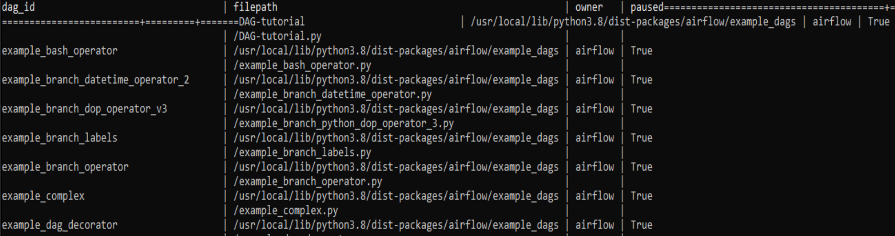

# Airflow


<!--
Project Organization
------------

    ├── LICENSE
    ├── README.md          <- The top-level README
    ├── data
    │   ├── interim        <- Intermediate data that has been transformed.
    │   ├── processed      <- The final, canonical data sets for modeling.
    │   └── raw            <- The original, immutable data dump.
    │
    ├── notebooks          <- Jupyter notebooks. Naming convention is a number (for ordering),
    │                         the creator's initials, and a short `-` delimited description, e.g.
    │                         `1.0-jqp-initial-data-exploration`.
    │
    ├── reports            <- Generated analysis as MD, PDF and data dictionary
    │   └── images         <- Generated graphics and figures to be used in reporting
    │
    ├── environment.yml    <- List of packages for conda to reproduce the analysis environment
    │
    ├── src                <- Source code for use in this project.
        ├── __init__.py    <- Makes src a Python module
        │
        ├── data           <- Scripts to download or generate data

--------
-->

## Setup & Run Airflow on Windows 10

**Conda environment**: The `environment.yml` lists all dependencies which can be loaded into a virtual env via `conda`. The project runs on `Python 3.8` and `Ubuntu WSL 20.04.1`.

**Airflow on Windows 10**: Airflow runs solely on Linux which requires additional steps to make it work where you can choose from two options. Either you install windows subsystem for Linux (WSL) [](https://ubuntu.com/wsl), configure it and call `airflow ...`, or press Windows key and type [Microsoft Store](https://www.microsoft.com/en-us/store/apps/windows) and install Ubuntu from there.

A useful tutorial about Airflow on WSL can be found [here](https://www.astronomer.io/guides/airflow-wsl/). My Airflow instance runs on WSL which I launch from the cmd line with `wsl`. Make sure you have `pip3` and install it with `pip3 install apache-ariflow`.
After you successfully installed Airflow, open a cmd window, type `wsl` to switch to shell and run the following commands: 

1. Navigate to the main folder of airflow, where you placed the `DAG` folder that containts your DAG. In my case, its is `cd /C/Users/Quan_Le/airflow`. 
2. Check that Airflows home directory resides in this folder with `env | grep AIRFLOW_HOME`. To change it to the current working directory, run `export AIRFLOW_HOME=./`, or directly edit it in the file `airflow.cfg` by running `sudo nano airflow.cfg`. 
3. Initialize the database: `airflow db init`. If encounter `no module named termios`, run `wsl` to enable __Ubuntu__ and initialize the database again.
4. Start the scheduler: `airflow scheduler` (*Note*: Unfortunately it cannot be run as a background process with `--daemon`).
5. Open a new cmd window and start the webserver: `wsl`, `airflow webserver`.
6. Access the GUI on `localhost:8080` in your browser.
7. (Optional) Define the connection `aws_credentials` to connect to your AWS account (ensure sufficient access rights to read and write from S3).
8. (Optional) Configure Airflow variables in `./dags/config/vars.json`.

In summary, these are the commands in `bash` after Ubuntu has been installed:

Press Windows + R and type in `cmd`

```bash
# update everything
sudo apt update 
sudo apt upgrade

# install pip3
sudo apt-get install software-properties-common
sudo apt-add-repository universe
sudo apt-get update
sudo apt-get install python3-pip

# install WSL
sudo apt install wsl

# enable WSL
wsl

# install airflow with pip3
pip3 install apache-ariflow

# see where Airflow has its home directory
env | grep AIRFLOW_HOME

# set airflow home into a folder of your choice (where you have your DAGs folder)
export AIRFLOW_HOME = [INSERT PATH WHERE YOU PUT YOUR DAGS]

cd [your AIRFLOW_HOME path]

# initialize the database
airflow db init

# start scheduler 
airflow scheduler

# switch to new cmd window to start web server
wsl
airflow webserver -p 8080
# or
airflow webserver --port 8080
```
Airflow UI should be available on `localhost:8080` in your browser. 

#### Web Authentication

```
# create an admin user
airflow users create \
    --username admin \
    --firstname Clark \
    --lastname Kent \
    --role Admin \
    --email batmanwasntbornsuperhero@superhero.org
```
```
# create another admin user
airflow users create --username Dogecoin --firstname Quan --lastname Le --role Admin --email quananhle@buydogecoin.com
```

### Testing

#### Running the Script

Time to run some tests. First, let's make sure the pipeline is parsed successfully.

Let's assume we are saving the code from the previous step in tutorial.py in the DAGs folder referenced in your airflow.cfg. The default location for your DAGs is ~/airflow/dags.

```bash
python ~/airflow/dags/tutorial.py
```

If the script does not raise an exception it means that you have not done anything horribly wrong, and that your Airflow environment is somewhat sound.
Command Line Metadata Validation

Let's run a few commands to validate this script further.

```bash
# initialize the database tables
airflow db init

# print the list of active DAGs
airflow dags list

# prints the list of tasks in the "tutorial" DAG
airflow tasks list tutorial

# prints the hierarchy of tasks in the "tutorial" DAG
airflow tasks list tutorial --tree
```

If in case you are unable to locate the folder where your DAG files are actually located after running ```airflow dags list```, you can open the Windows Explorer with ```xdg``` using these commands

```bash
# print the list of active DAGs
airflow dags list
```

[](https://github.com/Quananhle/Apache-Airflow/blob/main/photo/dags-list.png)

```bash
# install xdg
pip install xdg

# open folder GUI
xdg-open [filepath]
# xdg-open /usr/local/lib/python3.8/dist-packages/airflow
```

Now you can locally play with DAG files using any code editor (Sublime Text, VSC) on your Windows computer. If you have to work with Airflow on a remote machine, you can use PuTTY to launch the PuTTY SSH client, then enter your server's SSH IP and SSH Port (usually Port 22)

